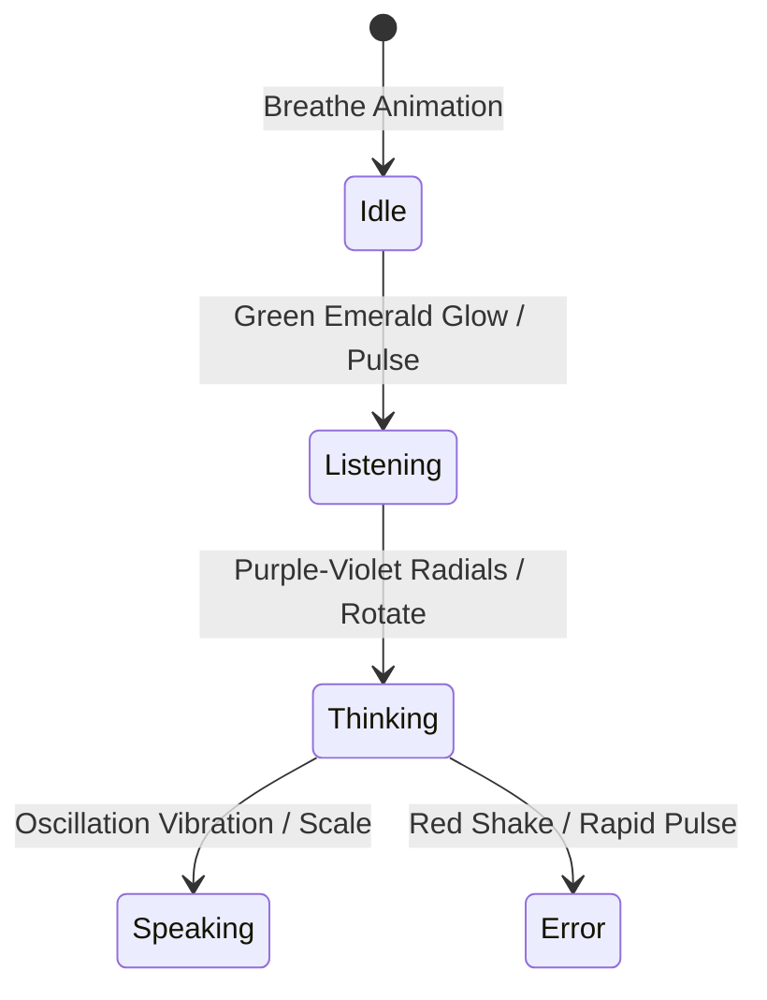

# AI Workspace Report

* **Feature/Subsystem**: AI OS Workspace & Core Orb States
* **Redesign Phase**: Phase 2 (AI Workspace & Operating System Experience)
* **Status**: IMPLEMENTED 🟢

---

## 1. Unified AI OS Vision
MONI is redesigned into a true AI Operating System where AI is not a separate chat panel but the core developer driver. AI possesses full contextual awareness of the active project explorer, the active file editor tab, cursor text selections, and local SecOps compliance errors.

---

## 2. Animated AI Core Orb
The static avatar images are replaced with a glowing CSS-animated AI Core Orb (`.moni-ai-orb`). It visually represents active state changes:

### CSS Animation Specifications
1. **Idle / Breathe (`orb-breathe`)**: Slow breathing transition using radial gradients (`rgba(0, 240, 255, 0.45)` to `rgba(157, 78, 221, 0.15)`).
2. **Listening (`orb-listen`)**: Rapid scaling pulse with emerald-green borders reflecting wake-word audio signals.
3. **Thinking (`orb-think`)**: Linear spinning radial rotations showing high-intensity background computation states.
4. **Speaking (`orb-speak`)**: Scale oscillation mimicking speech amplitude waves.
5. **Error (`orb-error`)**: High frequency micro-shaking and deep red flashing.

---

## 3. Compliance and Security Contexts
The AI Core reads environment variables and pipeline logs to suggest live self-healing operations directly to the workspace, providing a proactive operating system assistant.
