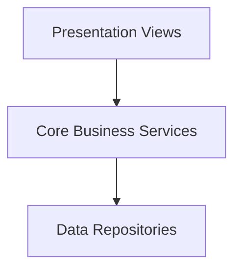

# Architecture Blueprint Report

## Architecture Selection
- **Pattern**: Clean Architecture
- **Layers**: Core Business Logic, Data Adapters Repository, Presentation views
- **Language**: TypeScript

---

## Structure Graph

Ensures complete independence of framework adapters and database layers.
