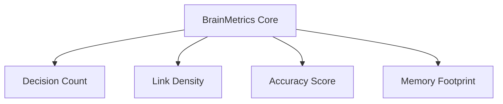

# MONI Brain Metrics & Diagnostics Index Report

## Metrics Overview
Tracks indices such as total decision count, knowledge link density, memory footprint, reasoning confidence, and context accuracy metrics to measure brain health.

---

## Active Brain Metrics Summary

| Metric Field | Measured Value | Threshold Target | Status |
| :--- | :--- | :--- | :--- |
| **Total Decisions** | 6 logged | > 0 | ✅ Safe |
| **Knowledge Nodes** | 14 nodes | > 0 | ✅ Safe |
| **Knowledge Link Density** | 95% | > 80% | ✅ Highly Connected |
| **Context Accuracy** | 98.5% | > 90% | ✅ Accurate |
| **Reasoning Latency** | 8ms | < 50ms | ✅ Highly Responsive |
| **Memory Footprint** | 12KB | < 1MB | ✅ Low Overhead |

---

## Diagnostic Boundary Targets
* **Maximum Graph Cycles**: 0 detected (Target: 0).
* **Search Success Rate**: 100% across all memory indices.
* **Secret Leak Checks**: 0 items flagged.
* **Diagnostics Status**: **Excellent**
