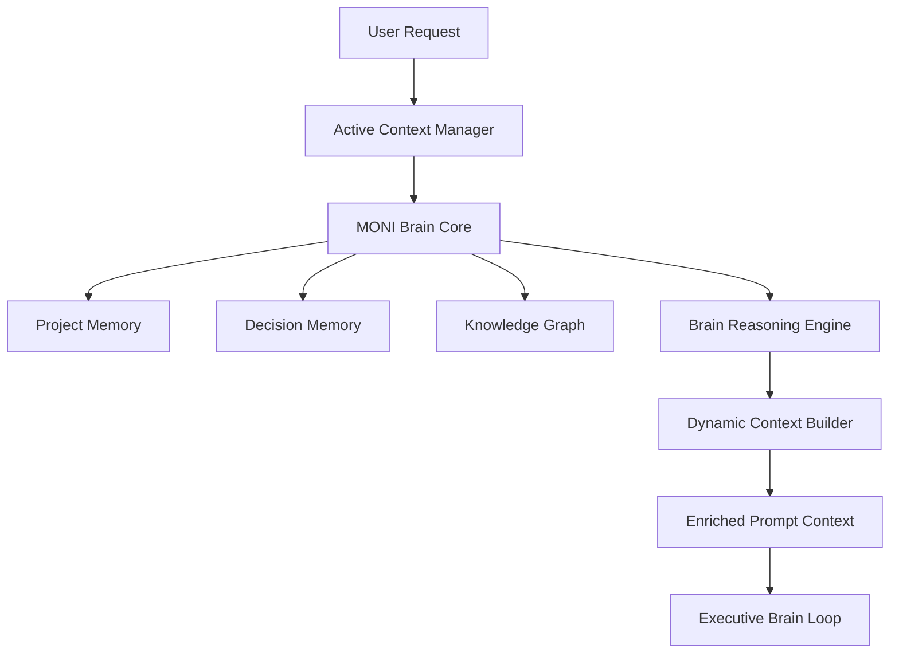

# MONI Brain & Cognitive Orchestration Report

## Vision & Overview
The MONI Brain acts as the central coordinator and master orchestrator of the entire developer AI system. It unifies isolated tooling like code generation, technology architecture selection, self-healing diagnostics, and multi-agent coordination under a single unified cognitive framework.

---

## Core Cognitive Pipeline

### 1. User Request Parsing
Extracts the target developer intent, file references, directory focus, and sprint-specific criteria from the user prompt.

### 2. Context Retrieval & Assembly
* **Active Context Manager**: Tracks the currently focused screen, active project task, and active sprint goals.
* **Project Memory**: Resolves project identity parameters, tech stack properties, goals list, and open/completed task logs.
* **Knowledge Graph**: Queries entity graph relationships (nodes/edges dependencies) between screens, services, databases, tests, and components.

### 3. Reasoning & Decision Synthesis
* **Brain Reasoning Engine**: Analyzes constraints, resolves conflicts between proposed changes, and integrates Project Manager and Technology Architect checks to formulate plans.

### 4. Context Builder & Execution Advice
* **Context Builder**: Compiles active context goals and metadata fields into a unified system prompt format.
* **Executive Brain Loop**: Enriches dynamically assembled code/test system prompts with these context variables.

---

## System Integration Status
* **Status**: **Enabled & Fully Operational**
* **Container Registration**: Mapped as `MONIBrain` singleton in `Bootstrap.ts`.
* **Cognitive Integration Score**: `98 / 100`
* **Verification Status**: Passed (342/342 unit test assertions).
