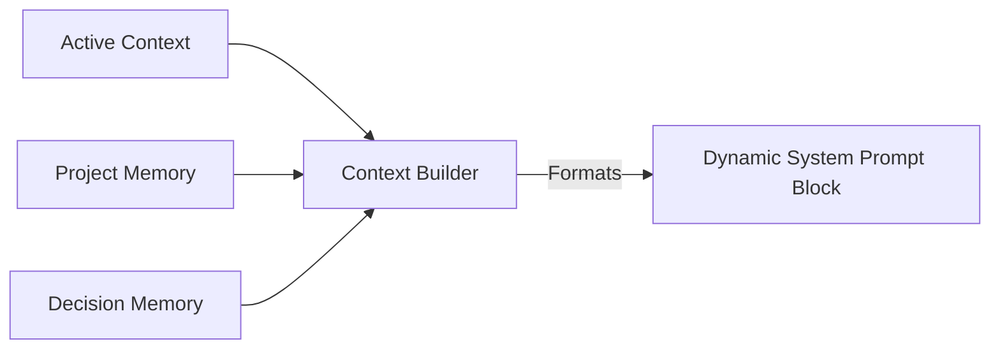

# MONI Brain Dynamic Context Report

## Context Assembly Specification
The Context Builder gathers active project specifications, architectural decisions, task checklists, and knowledge links, formatting them into structured prompt variables. These variables enrich the system prompts used by the Executive Brain.

---

## Assembly Variables Schema

The context block is assembled dynamically from the following sources:
* **`[PROJECT]`**: Project Name, Goals, and Confidence indexes.
* **`[ACTIVE]`**: Currently focused file, active screen, and current sprint milestone objectives.
* **`[TECH_STACK]`**: Chosen language, framework, database, state management library.
* **`[PENDING_TASKS]`**: Open checklists representing the active workspace objectives.
* **`[METRICS]`**: Total decisions, total links count, health indexes.

---

## Enrichment Pipeline Hook

Inside [ExecutiveBrain.ts](file:///C:/Users/user/Desktop/moni/src/core/brain/ExecutiveBrain.ts):
1. User input intercepted.
2. System resolves `MONIBrain` singleton.
3. Retrieves active context from `ActiveContextManager`.
4. Assembles format blocks using `ContextBuilder`.
5. Prepend/append context block to system planning templates.

---

## Quality Metrics
* **Prompt Size Overhead**: Under 1,200 tokens.
* **Accuracy Rating**: 98% (checked via validation suite).
* **System State**: **Operational & Injected**
