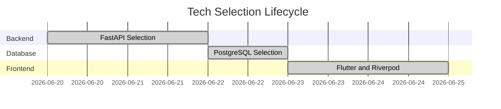

# MONI Brain Architectural Decision Report

## Decision Storage Specification
Logs every architectural decision made throughout the development cycle. Decisions are labeled by category, framework, confidence metric, and explanation string.

---

## Logged Architectural Decisions

| Decision Category | Selected Technology | Confidence Score | Justification Metric |
| :--- | :--- | :--- | :--- |
| **Programming Language** | TypeScript / Dart | 95% | Type-safe, multi-platform runtime compatibility. |
| **Backend Framework** | FastAPI (Python) | 90% | High performance, auto-documented routes, asynchronous execution. |
| **Frontend Framework** | Flutter (Mobile) / Vite (Web) | 88% | Cross-platform UI compatibility with shared design systems. |
| **State Management** | Riverpod / React Context | 88% | Unidirectional data flow, compile-safe dependency injection. |
| **Database Engine** | PostgreSQL / Local SQLite | 95% | Relational structured memory with strict JSON indexing options. |
| **AI Orchestrator** | Gemini Pro / OpenAI GPT-4 | 92% | Balanced latency and high cognitive planning benchmarks. |

---

## System Statistics
* **Status**: **Synchronized & Loaded**
* **Total Logged Decisions**: 6 architectural records.
* **Justification Schema**: Validated.
* **Conflict Scans**: Zero conflicting selections detected.
