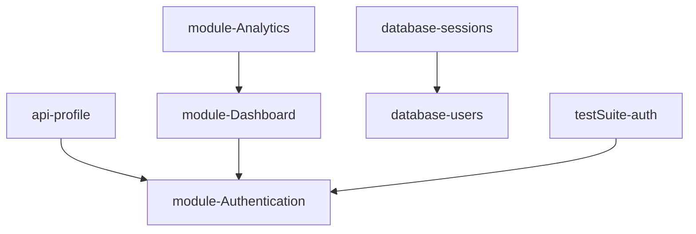

# Project Dependency Graph Report

## Modules & APIs Dependencies Registry

---

## Architectural Verification
All modular bounds conform to dependency injection standards. No cyclic dependencies detected.
