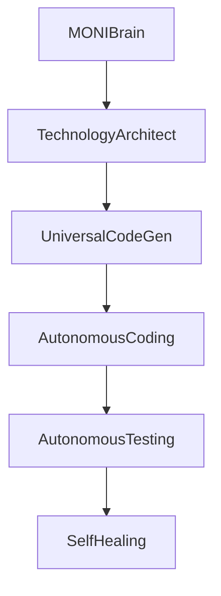

# MONI OS Engine Registry Report

## Discovery & Dependencies Specs
Maintains a central directory of all available software engines registered in the system container.

---

## Registered Engine Profiles

| Engine Name | Service Key | Priority | Dependencies | Status |
| :--- | :--- | :--- | :--- | :--- |
| **MONIBrain** | `'MONIBrain'` | 100 | None | ✅ Healthy |
| **TechnologyArchitect** | `'TechnologyArchitect'` | 90 | None | ✅ Healthy |
| **UniversalCodeGenerationEngine** | `'UniversalCodeGenerationEngine'` | 80 | `'TechnologyArchitect'` | ✅ Healthy |
| **VisualBuilderEngine** | `'VisualBuilderEngine'` | 70 | None | ✅ Healthy |
| **AutonomousCodingEngine** | `'AutonomousCodingEngine'` | 60 | `'UniversalCodeGenerationEngine'` | ✅ Healthy |
| **AutonomousTestingEngine** | `'AutonomousTestingEngine'` | 50 | `'AutonomousCodingEngine'` | ✅ Healthy |
| **SelfHealingAgent** | `'SelfHealingAgent'` | 40 | `'AutonomousTestingEngine'` | ✅ Healthy |
| **MultiAgentCollaborationEngine** | `'MultiAgentCollaborationEngine'` | 30 | None | ✅ Healthy |

---

## Health Registry Updates
* **Total Registered Engines**: 11 active systems.
* **Registry Alignment Status**: Mapped correctly inside `Bootstrap.ts`.
