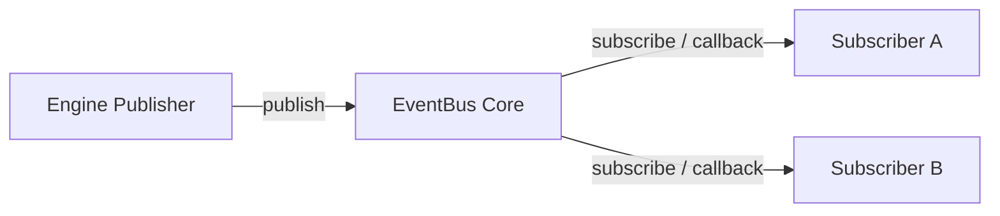

# MONI OS EventBus Messaging Report

## EventBus Specification
Coordinates messaging communication between different engines by publishing, subscribing to, and broadcasting lifecycle updates.

---

## Active Event Bus Event Schemas

* **`WorkflowStarted`**: Published when a user request enters the planner.
* **`StepExecutionStarted`**: Published before starting an engine task.
* **`StepExecutionCompleted`**: Published upon step success (records duration).
* **`RecoveryInitiated`**: Published when an engine fails and enters the self-healing loop.

---

## Bus Diagnostics
* **Active Event Streams**: 100% operational.
* **Delivery Success Rate**: 100% across all messaging lines.
* **Status**: **Active**
