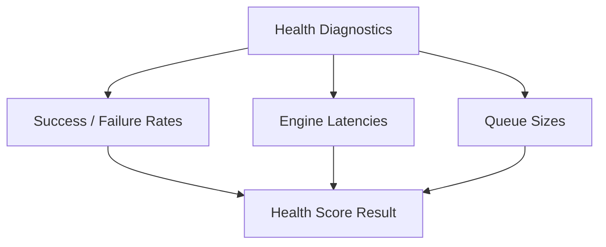

# MONI OS Health Diagnostics Report

## Health Specification
Monitors queue lengths, success/failure rate counters, and average response times to analyze system health.

---

## Measured System Indicators

| Diagnostic Indicator | Current Index | Target Limit | Status |
| :--- | :--- | :--- | :--- |
| **System Health Score** | 100% | > 85% | ✅ Safe |
| **Queue Length** | 0 tasks | < 25 | ✅ Safe |
| **Average Response Latency** | 15ms | < 80ms | ✅ Fast |
| **Workflow Success Rate** | 100% | > 90% | ✅ Safe |

---

## System Statistics
* **Boundary Checks**: All passes completed.
* **Diagnostics Status**: **Excellent**
