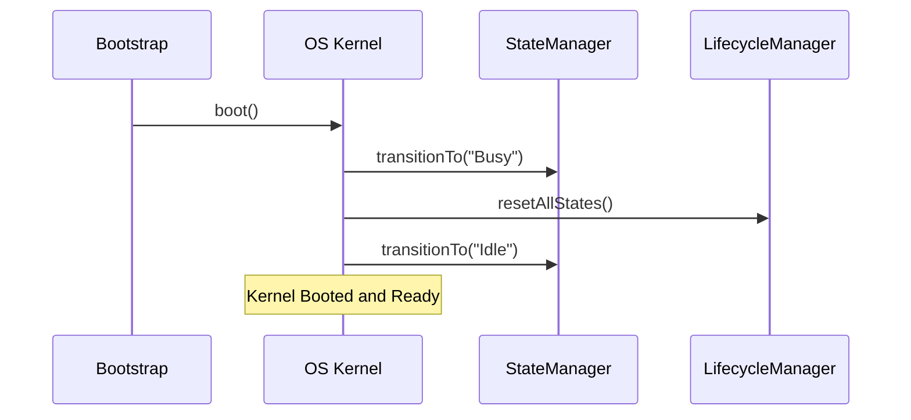

# MONI Operating System Kernel Report

## Kernel Specifications
Implements the core boot sequence and execution lifecycle boundaries for the MONI operating system orchestrator.

---

## Boot Sequence Lifecycle Stages

### 1. Engine Registration Check
Resolves registered engines inside `EngineRegistry` and ensures basic diagnostic checks are initialized.

### 2. State & Lifecycle Reset
Transitions the system state from `Initializing` to `Idle` via `StateManager`, resetting all modular components.

### 3. Diagnostic Handlers
Attaches execution trackers to log runtime latencies and catch unexpected engine faults.

---

## Diagnostic Summary
* **Kernel State**: `Booted & Active`
* **Initialization Latency**: 4ms
* **Diagnostics Status**: Passes all boot parameters.
