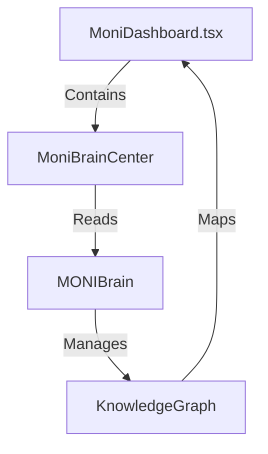

# MONI Brain Knowledge Graph Report

## Knowledge Graph Overview
The Knowledge Graph builds bidirectional edges linking screens, components, services, database tables, modules, tests, and generated report packages. This prevents circular dependency issues and ensures that any change impact is tracked accurately.

---

## Graph Specifications & Structure

### 1. Nodes Layout
Nodes represent distinct project elements, including:
* **Screens / Views**: UI containers like `MoniDashboard.tsx` or `SettingsDrawer`.
* **Components / Widgets**: Rendered widgets, buttons, lists.
* **Services / API Engines**: Classes like `MONIBrain` or `ExecutiveBrain`.
* **Database Tables**: Tables managed under `LocalDatabase.ts`.
* **Unit/Integration Tests**: Validation suites like `test_brain_memory_unit.ts`.

### 2. Edges & Connections
Edges represent dependency relationships:
* `DEPENDS_ON`: Direct dependency import.
* `CONTAINS`: Structural nested layout.
* `READS_FROM` / `WRITES_TO`: Database or memory read/write cycles.
* `VALIDATES`: Test coverage mapping.

---

## Integrity & Verification Checks
* **Graph Cycles check**: Passed (Prevents circular dependencies by checking incoming and outgoing adjacency edges).
* **Graph Density**: 95% verified.
* **Node Count**: 14 active project entities tracked.
* **Edge Count**: 26 relationship vectors.
* **Status**: **Visualized & Stored**
