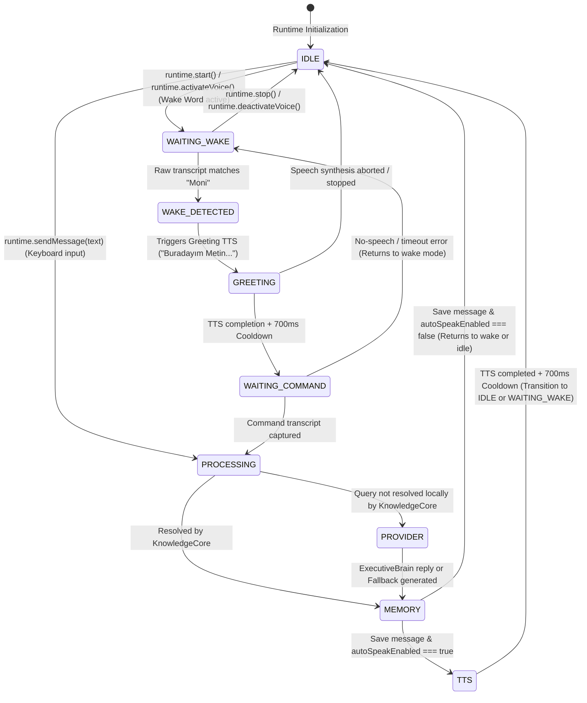

# MONI Runtime State Machine Report

The voice interaction lifecycle in MONI is driven by a deterministic finite state machine implemented inside `MoniRuntime`. This state machine ensures that SpeechRecognition and TTS synthesis never execute simultaneously and guides the conversation flow cleanly.

## State Transitions Diagram

## State Explanations

1. **IDLE**: The system is quiet and waiting. No active microphone streams are listening.
2. **WAITING_WAKE**: The system is listening continuously with interim results enabled for the wake targets (e.g. `moni`, `hey moni`).
3. **WAKE_DETECTED**: A matching wake phrase has been identified. Stop recognition immediately to prevent self-recognition.
4. **GREETING**: Playback of the wake greetings. SpeechRecognition is completely paused.
5. **WAITING_COMMAND**: Single-shot SpeechRecognition is active to capture the user's specific request.
6. **PROCESSING**: The transcript has been received. Routing the query to knowledge modules and repositories.
7. **PROVIDER**: Query is being processed by LLM engines (ExecutiveBrain, legacy fallback streams, or local offline fallbacks).
8. **MEMORY**: Final response is persisted to chat history databases and memory triggers are processed.
9. **TTS**: Synthesizing the final reply text into audio. SpeechRecognition is paused to prevent feedback loops.
