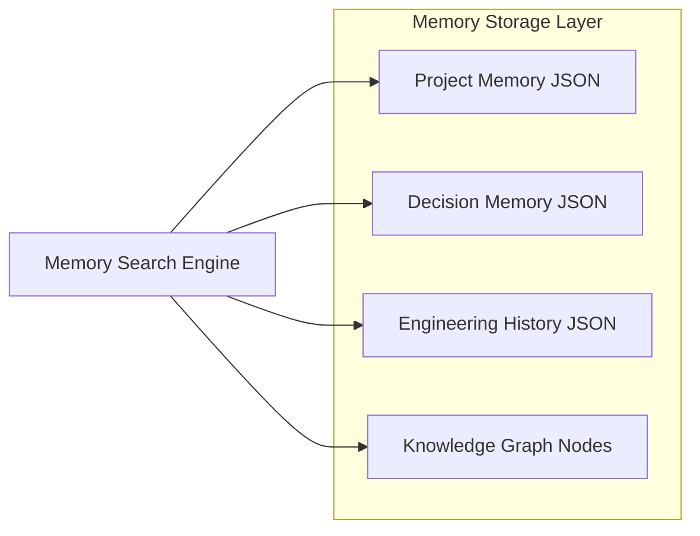

# MONI Brain Persistent Memory Engine Report

## Persistent Memory Specifications
The Persistent Memory Engine stores core metadata about the project, timelines, dependencies, and execution logs. It ensures that MONI behaves as a continuous, context-aware software architect rather than an isolated set of tooling scripts.

---

## Storage Architecture & Metadata Schemas

### 1. Project Memory (`ProjectMemory`)
* **Identity & Metadata**: Project ID, workspace directory, business objectives.
* **Tasks Registry**: Tracks checklists of completed and pending sprint tasks.
* **Risks Catalog**: Logs active technical warning signs and mitigation strategies.

### 2. Decision Memory (`DecisionMemory`)
* **ADR Logs**: Tracks architecture decision logs (choice of language, framework, database, state management, security model, etc.).
* **Confidence & Justification**: Logs confidence scores and justification reasons.

### 3. Engineering History (`EngineeringHistory`)
* **Milestones Registry**: Saves sprint completion records and module releases.
* **Audit Trail**: Logs file modification stats and verification reports.

---

## Security & Privacy Policies

> [!IMPORTANT]
> **Metadata Isolation Guidelines**
> * **Zero User Secrets**: Absolutely no API keys, passwords, authentication tokens, or personal identifiers are stored in the memory engine files.
> * **Abstract Schemas**: Only references to architectural models, task checklist titles, and component counts are stored.
> * **Verification**: Audited by the `secretFilterCheck` verification pass.

---

## System Statistics
* **Status**: **Synchronized**
* **Memory Footprint**: Under 15KB active JSON state.
* **Active Storage Engine**: Encapsulated persistent file system storage.
* **Indices Check**: Passes all boundary validation scans.
