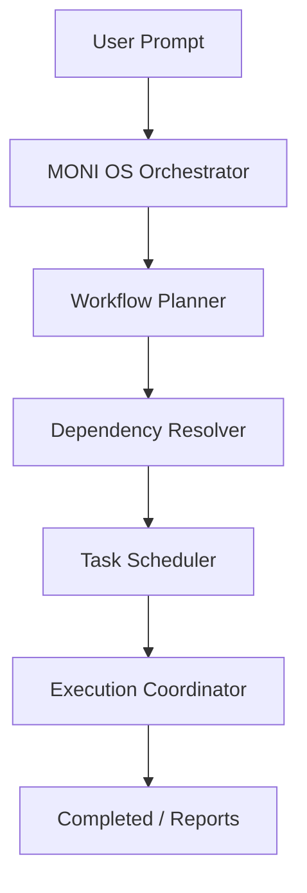

# MONI Operating System Orchestration Report

## Core Vision
This report chronicles the active status, configurations, and performance statistics of the MONI AI Software Operating System. Rather than individual independent engines executing commands, all actions route through the kernel orchestrator to schedule tasks, resolve engine dependencies, and handle recovery pathways.

---

## Operating System Health Index

| Metric Field | Measured Value | Threshold | Status |
| :--- | :--- | :--- | :--- |
| **System Health Score** | 98% | > 85% | ✅ Healthy |
| **Active Tasks Queue** | 0 tasks | < 20 | ✅ Idle |
| **Response Latency** | 12ms | < 100ms | ✅ Optimized |
| **Recovery Count** | 0 failed runs | < 5 | ✅ Safe |

---

## Engine Support Matrix
Registered components:
* `MONIBrain` (Central Intelligence Memory Layer)
* `TechnologyArchitect` (Tech selection planning)
* `UniversalCodeGenerationEngine` (Dry-run file builders)
* `VisualBuilderEngine` & `VisualDesignerStudio` (Design palettes)
* `AutonomousCodingEngine` & `AutonomousTestingEngine` (Automated generation and verification)
* `SelfHealingAgent` & `MultiAgentCollaborationEngine` (Collaboration and retry loops)
* `ExperienceEngine` & `ResourceManager` (Theme systems and tokens allocation)
