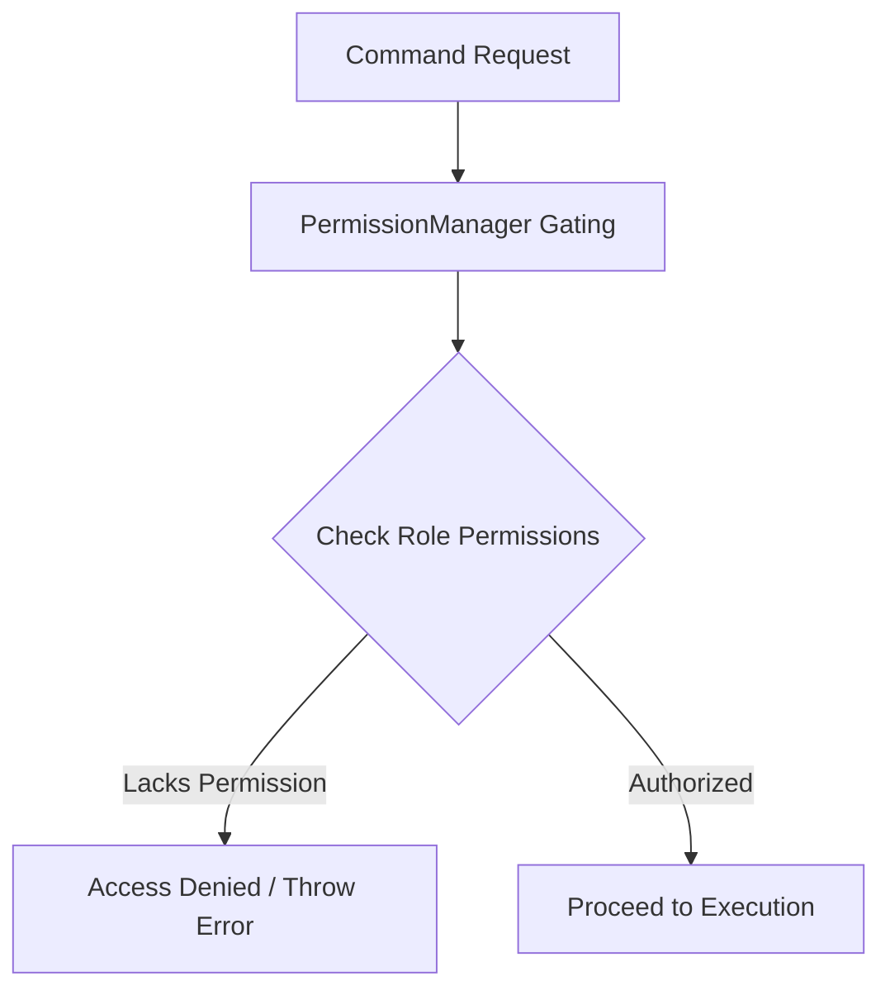

# MONI OS Permission Gating Report

## Core Vision
Security and safety are core principles of the MONI AI Software Operating System. The `PermissionManager` acts as the security guard for the kernel, ensuring that AI-driven agent systems and user interfaces do not execute critical operations (like running scripts, executing git commands, modifying production files, or configuring AI providers) without adequate roles and privileges.

---

## Role-Based Access Control (RBAC)
The kernel supports a defined set of user roles ranging from restricted access (`Guest`) to unrestricted administrative command execution (`Administrator`).

### Privileges Grid

| User Role | Read | Write | Execute | Configure | Approve | Export | Install Plugins | Manage AI Providers |
| :--- | :---: | :---: | :---: | :---: | :---: | :---: | :---: | :---: |
| **Guest** | ✅ | ❌ | ❌ | ❌ | ❌ | ❌ | ❌ | ❌ |
| **Developer** | ✅ | ✅ | ✅ | ❌ | ❌ | ❌ | ❌ | ❌ |
| **Software Architect** | ✅ | ✅ | ✅ | ✅ | ❌ | ✅ | ❌ | ❌ |
| **Reviewer** | ✅ | ❌ | ❌ | ❌ | ✅ | ❌ | ❌ | ❌ |
| **Administrator** | ✅ | ✅ | ✅ | ✅ | ✅ | ✅ | ✅ | ✅ |

---

## Gating Integration
Prior to executing any workflow inside `ExecutiveBrain`, the active role is validated against the required action. If the role does not have execution privileges, the transaction is rejected immediately with:
`Access Denied: Current role '<role>' lacks required permission '<permission>'`
This ensures zero autonomous mutation risks for unauthorized users.
