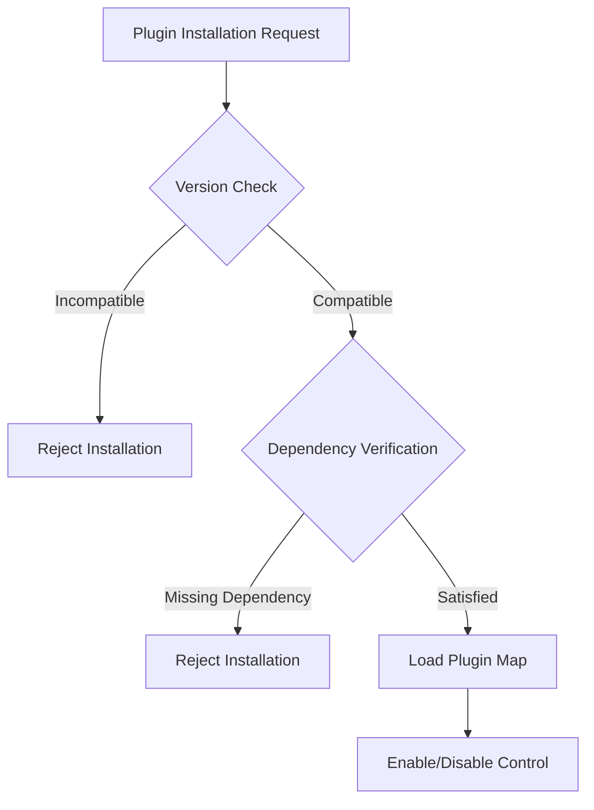

# MONI OS Plugin Architecture Report

## Core Vision
The Plugin Architecture for the MONI operating system kernel introduces modularity, allowing third-party extensions, custom language adapters, and integration hooks to be added, enabled, disabled, and configured dynamically. This ensures that the core kernel remains thin, high-performance, and robust, while custom capabilities can be hot-loaded as plugins.

---

## Technical Specifications & Lifecycle
The plugin subsystem enforces strict validation on compatibility and dependency matching before allowing initialization.



### Constraints & Dependency Checking
- **OS Compatibility Engine**: Verifies that the plugin targets the correct minimum core version (e.g. `>=5.6.0`).
- **Engine Dependency Matching**: Resolves dependencies prior to execution. If a plugin requires a specific engine (like `ExperienceEngine` or `RepositoryIntelligenceEngine`), the manager ensures that the engine is active before enabling the plugin.

---

## Current Plugins Inventory

| Plugin ID | Plugin Name | Version | Dependencies | Status | Health |
| :--- | :--- | :--- | :--- | :--- | :--- |
| **spotify** | Spotify Player Plugin | 1.2.0 | ExperienceEngine | Enabled | ✅ Healthy |
| **git-scanner** | Git Version Scanner | 2.0.4 | RepositoryIntelligenceEngine | Disabled | ✅ Healthy |

---

## Developer Guide: Custom Plugins
To author a new plugin, implement the `PluginInfo` interface:
```typescript
interface PluginInfo {
  id: string;
  name: string;
  version: string;
  status: 'enabled' | 'disabled';
  dependencies: string[];
  compatibility: string;
  health: 'healthy' | 'critical';
}
```
Register the plugin with the kernel using the `PluginManager`'s `install` method.
