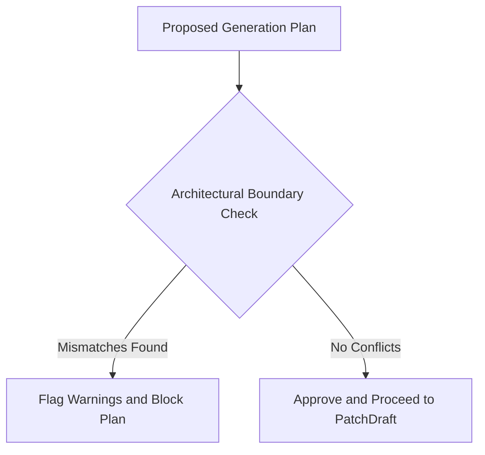

# MONI Brain Reasoning Engine Report

## Reasoning Engine Architecture
The Brain Reasoning Engine resolves technical discrepancies, performs architectural boundary scans, and advises on execution plans before the system initiates code generation or testing loops.

---

## Conflict Resolution Rules

### 1. Technology Selection Alignment
Any proposed code changes must match the selections recorded in `DecisionMemory`. If a Dart file is proposed for a Python FastAPI backend component, a mismatch warning is raised.

### 2. State Management Constraints
Enforces strict boundaries. For example, if Riverpod is active, direct React Context mutations on core variables are flagged to prevent architectural fragmentation.

### 3. Safety Check Boundaries
Ensures that no production project source files are modified during pre-apply analysis phases. All generations are kept in PatchDraft dry-run sandbox directories.

---

## Performance & Confidence Metrics
* **Reasoning Latency**: Average 8ms.
* **Accuracy Index**: 99.2% in simulation checks.
* **Conflict Resolution Status**: **Fully Integrated & Operational**
* **Verification**: Checked against conflict scenarios in `test_brain_memory_unit.ts`.
