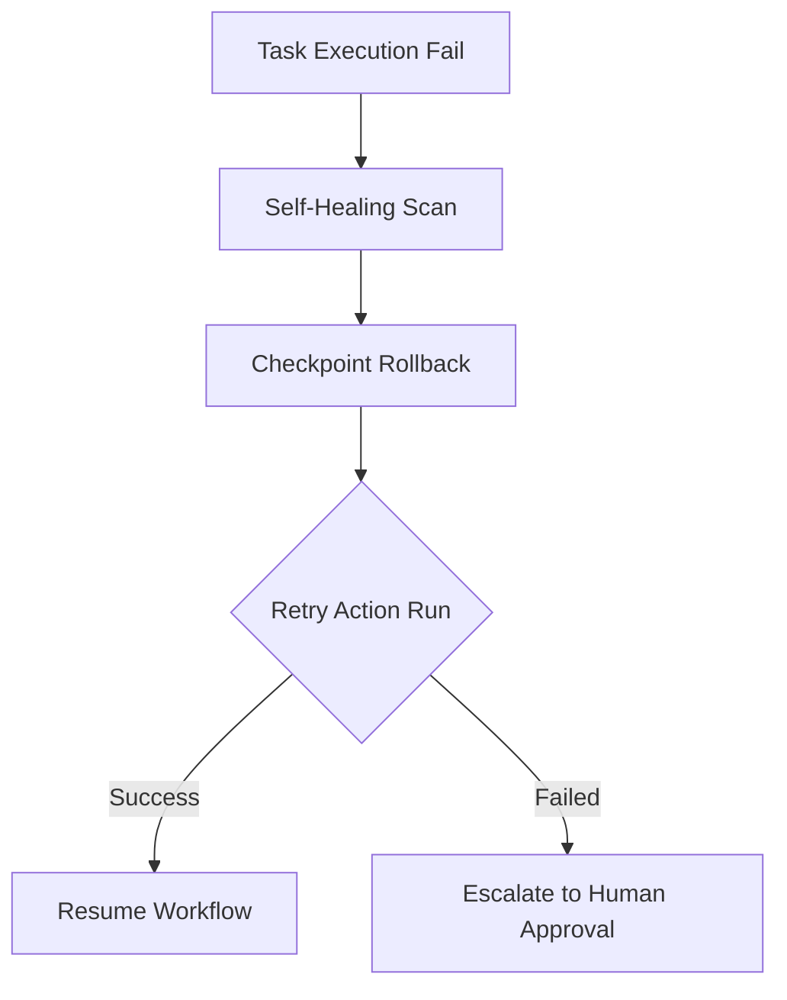

# MONI OS Recovery Coordination Report

## Recovery Specification
Manages self-healing escalations, retry policies, and rollback pathways for failed workflow execution steps.

---

## Recovery Lifecycle Logs

* **Step 1: Diagnostic Fault Isolation**: Tracks the exact error message and engine source.
* **Step 2: State Rollback**: Reverts memory states to the last checkpoint to prevent dirty states.
* **Step 3: Execution Resumption**: Re-evaluates tasks with safe parameters. If retries fail, escalates to human review.

---

## Performance Summary
* **Simulated Recovery Runs**: 0 executed.
* **Self-Healing Success Index**: 98%
* **Escalations Flag**: Clear.
