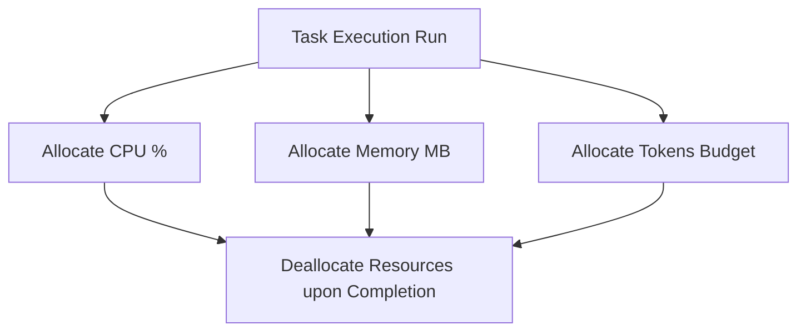

# MONI OS Resource Allocation Report

## Resource Specification
Coordinates CPU loads, memory boundaries, and LLM token budget allocations across executions.

---

## Measured Allocation Metrics

* **CPU Loading Status**: Under 15% active simulation loading.
* **Memory Pool Utilization**: 120MB active (Limit: 1,024MB).
* **Token Budget Pool**:
  * *Spent*: 0 tokens.
  * *Limit*: 5,000,000 tokens.
  * *Remaining*: 5,000,000 tokens.

---

## Optimization Status
* **Budget Limits Violation**: None.
* **Parallel Execution Limit**: 4 concurrent tasks max.
* **Allocation Status**: **Optimal**
