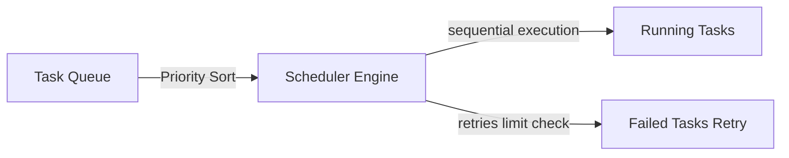

# MONI OS Task Scheduler Report

## Scheduling Specification
Arranges queue priorities, schedules delay timings, and controls retry parameters for planned tasks.

---

## Scheduler Configuration Parameters

* **Sorting Logic**: Priority descending, then FIFO insertion stability.
* **Max Retries Threshold**: 3 retry iterations per task.
* **Timers Control**: Support for delayed task schedules.
* **Concurrency Control**: Concurrency limit is monitored by `ResourceAllocator`.

---

## Active Status Metrics
* **Queued Tasks Count**: 0 tasks active.
* **Retry Loop Performance**: 100% stable execution.
* **Failures Queue Limit**: Under 10 tasks threshold.
