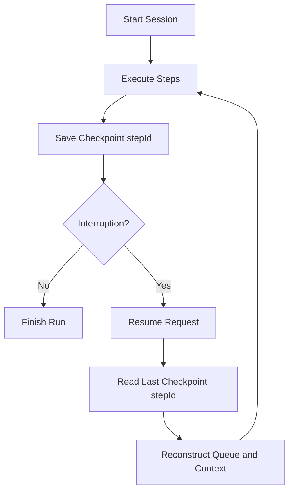

# MONI OS Session Resilience Report

## Core Vision
AI coding operations can take significant time and are susceptible to environmental disruptions (network drops, tool timeouts, or user interruptions). The `SessionManager` provides checkpointing and session restoration features to guarantee that interrupted runs can resume exactly from their last successful checkpoint step, preventing redundant token usage and rebuilding of context.

---

## Checkpointing and Resuming Flows
The session engine keeps a history of running sessions and records queue snapshots.

---

## Session Details
- **`sessionId`**: Generated unique ID for the current context.
- **`timestamp`**: Time of last modification.
- **`activeContextSummary`**: Engineering description of goals.
- **`schedulerQueueSnapshot`**: The remaining task queue order.
- **`lastCheckpointStepId`**: The last completed step key.

### Data Security Control
> [!IMPORTANT]
> The session state only records metadata, scheduling checkpoints, and steps IDs.
> No passwords, secrets, tokens, API keys, or private code variables are stored in the session payload.
