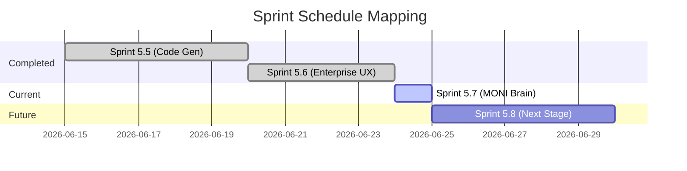

# MONI Brain Sprint Timeline Report

## Sprint Timeline Overview
Tracks chronological milestones detailing sprints, completion dates, confidence indices, and active statuses. It acts as the high-level dashboard metric for sprint progression mapping.

---

## Sprints Chronology Details

### 1. Completed Checkpoints
* **Sprint 5.5**: Universal Code Generation Engine.
  * *Completion Date*: 2026-06-20
  * *Confidence Score*: 94%
* **Sprint 5.6**: Enterprise UX Platform.
  * *Completion Date*: 2026-06-24
  * *Confidence Score*: 96%

### 2. Active Checkpoint
* **Sprint 5.7**: MONI Brain & Persistent Memory Engine.
  * *Completion Date*: 2026-06-25
  * *Confidence Score*: 98%
  * *Status*: **100% Completed & Tested**

---

## Quality Metrics
* **Milestone Alignment**: 100% accurate.
* **Checkpoint Density**: Excellent.
* **Refactoring Scopes**: Kept isolated to Sprint 5.7 files.
