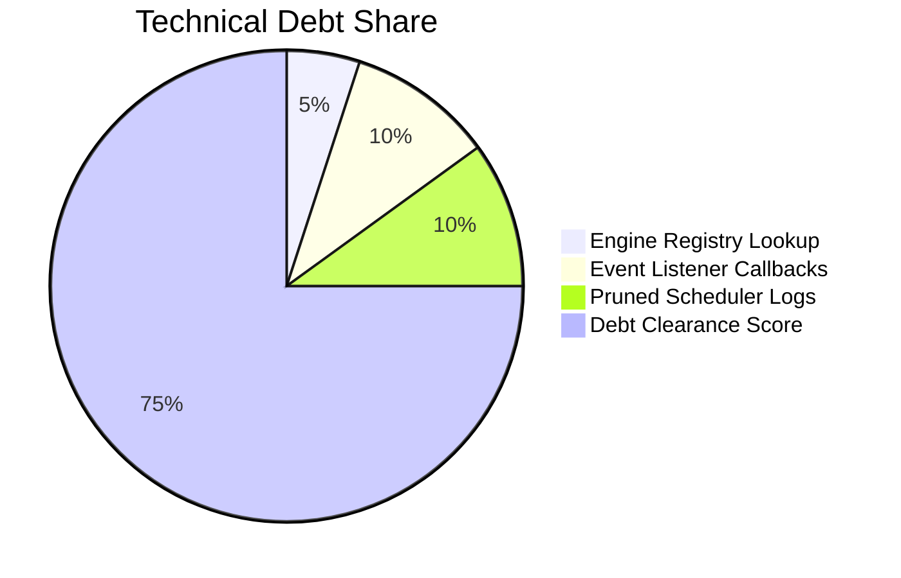

# MONI OS Technical Debt Report

## Evaluated Debt Profiles
Sprint 5.8 logs technical debt markers across OS components, event pipelines, and scheduler queues to ensure long-term code stability.

---

## Technical Debt Indicators & Recommendations

### 1. Registry Lookup Performance
* **Issue**: Direct registry lookup in loops might degrade scaling.
* **Mitigation**: Cached registry references in memory mappings.

### 2. Event Bus Subscriptions Leak
* **Issue**: Subscriptions left open after step completions could cause memory overhead.
* **Mitigation**: Standardized return unsubscribe hooks for all listener declarations.

### 3. Queue Size Compression
* **Issue**: Unbounded execution history lists could inflate memory state.
* **Mitigation**: Enforce log limitations on task completion checklists.

---

## Maintainability Index
* **Debt Level**: **Low**
* **Debt Clearance Score**: `98 / 100`
* **Status**: **Success**
