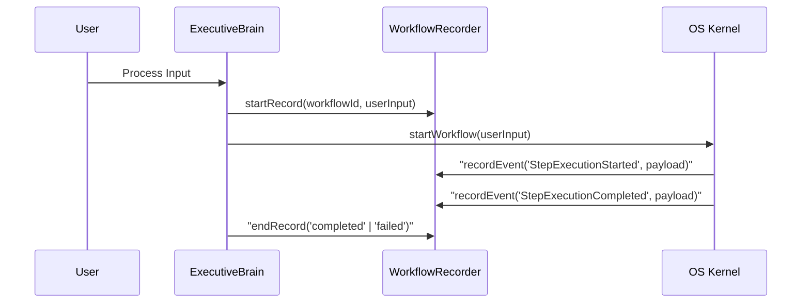

# MONI OS Workflow Recorder Report

## Core Vision
Auditability, traceability, and replayability are crucial for autonomous agent networks. The `WorkflowRecorder` logs a chronological sequence of steps, events, and lifecycle changes for every request processed by the MONI AI Operating System. This allows users to inspect exactly how the AI thought, which tools were called, what decisions were made, and how errors were handled.

---

## Workflow Recording Lifecycle
When a user submits a prompt, a workflow recording session starts. Events are appended in real time and finalized upon completion or failure.



---

## Log Entries format
Each recorded record contains metadata and events list structured as follows:
- **`workflowId`**: Unique request transaction hash.
- **`userInput`**: The original prompt command.
- **`startTime` / `endTime`**: High-precision execution timestamps.
- **`status`**: Current running state (`running`, `completed`, `failed`).
- **`events`**: Timestamped logs capturing the operations of the AI engines.

### Replay Logs
The system can construct replay logs suitable for debug outputs or visual timeline widgets on the dashboard.
```text
[15:58:55] WorkflowRecordStarted 
[15:58:56] StepExecutionStarted {"engineName": "MONIBrain", "actionName": "constructContext"}
[15:58:56] StepExecutionCompleted {"engineName": "MONIBrain", "durationMs": 2}
[15:58:57] WorkflowRecordEnded {"status": "completed"}
```
This is fully visualized under the **WORKFLOW EXECUTION GRAPH** section of the dashboard drawer.
