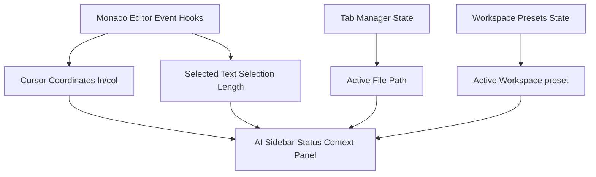

# MONI Workspace AI Context Integration Report

This report explains the metadata context synchronization between the Monaco Editor viewport and the right AI Sidebar copilot.

## 1. Context Metadata Metrics

The AI Sidebar displays the active state metrics of the developer's workspace:

- **Active Context File**: Displays the current file name and relative workspace path.
- **Monaco Cursor Coordinates**: Tracks `Ln` and `Col` via Monaco Editor's `onDidChangeCursorPosition` hook callbacks.
- **Selection Length**: Displays the number of characters currently highlighted in the active editor panel.
- **Active Layout Mode**: Displays the active workspace preset configuration.

---

## 2. Context Synced Elements Catalog

These values are kept in synchrony with the editor interface and allow the AI Sidebar to understand what the user is inspecting:

---

## 3. Preservation of AI Backend

All context data is handled purely on the client UI level. No backend APIs, schemas, or memory engine behaviors are modified, preserving the stability of the AI core.
