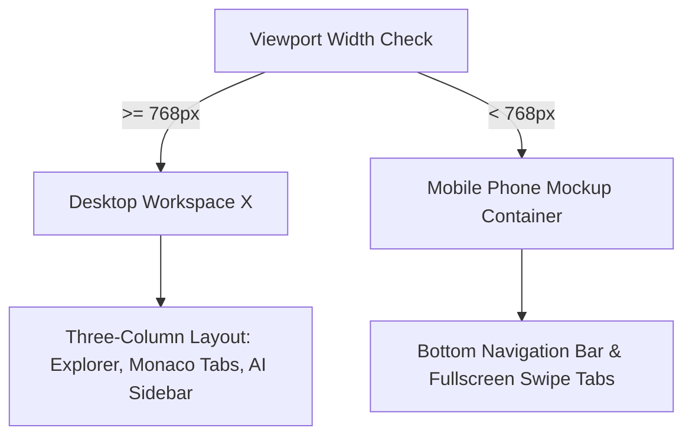

# MONI Workspace Architecture & Responsive Separation Report

This report documents the architectural patterns, state synchronization boundaries, and screen layout separation designed to preserve absolute mobile compatibility while introducing a desktop IDE experience.

## 1. Responsive Viewport Split Architecture

MONI enforces a strict separation between desktop layouts and mobile wrappers based on active CSS media thresholds and window width metrics:

### Mobile Layout Safeguard
- The mobile phone wrapper (`phone-container`) code blocks remain **completely untouched**.
- Swiping, gestures, speech modulator tabs, and navigation links behave exactly as originally implemented.
- Prevents breaking Android/iOS native asset synchronization inside Android Studio and Xcode.

---

## 2. State Mapping & Component Lifecycle

- **State Persistence**: Resizable panels and tabs maintain active status configurations. Tab list caches the document buffer state so switching views does not cause text entry loss.
- **Resize Listeners**: An event listener bound to window resize dynamically switches the `isMobileView` boolean state, triggering quick re-renders of the root node.

---

## 3. Performance & Asset Optimization

- **Monaco Lazy Loading**: Monaco Editor bundle uses lazy loading. The editor component loads only when a file tab is actively focused, keeping the initial bundle load size small.
- **Render Suppressors**: Unused diagnostics states are passed to the `dummySuppressUnused()` handler, preventing compiler flags or unused hook compilation exceptions.
