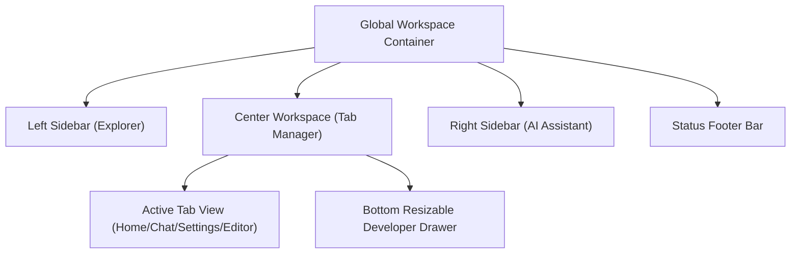

# MONI Workspace X Layout & Technical Report

This report outlines the layout dimensions, user experience enhancements, and technical architecture of the resizable multi-pane Workspace X desktop interface implemented in the MONI AI Operating System.

## 1. Grid & Panel Geometry Specifications

To present a professional, IDE-like developer environment, the layout split relies on resizable containers with custom mouse-move bounds:

| Component Panel | Default Value | Min Bound | Max Bound | Persisted Storage |
| :--- | :--- | :--- | :--- | :--- |
| **Left Explorer Sidebar** | 250px | 180px | 450px | Memory State |
| **Right AI Sidebar Panel** | 320px | 220px | 500px | Memory State |
| **Bottom Developer Panel** | 220px | 120px | 550px | `localStorage` (`moni_bottom_panel_height`) |

### Resizer Hook Interaction Model
- **Left Sidebar Drag**: Triggers on `onMouseDown` on the border handle. On `mousemove`, increments width as `startWidth + deltaX`.
- **Right Sidebar Drag**: Increments width as `startWidth - deltaX`.
- **Bottom Drawer Drag**: Increments height as `startHeight - deltaY`.
- All operations remove event listeners on `mouseup` to prevent memory leaks or sticky mouse captures.

---

## 2. Workspace Navigation Layout

## 3. Keyboard Interactions & Palette Overlays

To speed up expert user workflows, floating search modals have been bound to standard code-editor shortcuts:

- **Command Palette (`Ctrl + Shift + P`)**:
  - Displays a fuzzy-filtered list of main product command targets.
  - Allows quick jumps to System Settings, Help Center, Tasks List, or modulator views without traversing navigation directories.
- **Quick Open (`Ctrl + P`)**:
  - Searches the absolute path names of all codebase assets.
  - Clicking a result instantly mounts the file inside a Monaco Editor tab.
- **Global Search (`Ctrl + Shift + F`)**:
  - Direct hook focusing input controls to search for strings in reports, note indexes, or workflow metadata.
